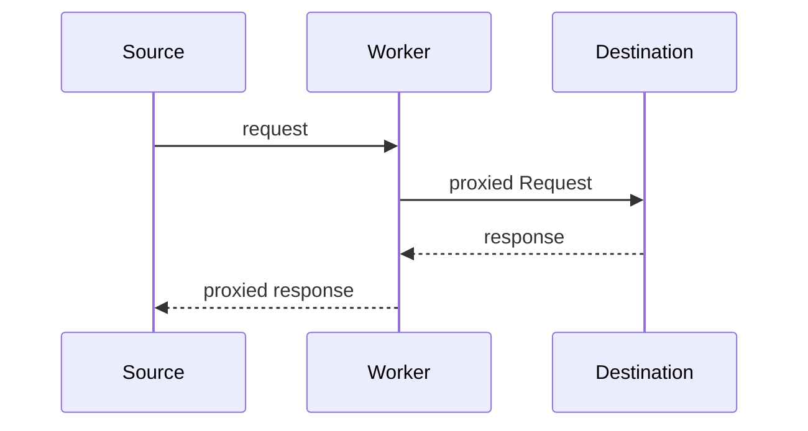

# Endpoint Pass-through

A serverless API endpoint proxy pass-through, currently designed to work specifically with Cloudflare Workers.

The objective of this project is to provide a small and lightweight package that can securely proxy connections from specific hostnames or IPs, allowing frontend apps to call APIs of various services without exposing secret keys.

### Usage

- Create a Cloudflare Workers account
- Fork or clone this repo so that you can customize it to your specific use case
- Within Cloudflare, create and include a key and add it to the `wrangler.toml` config file in the `account_id` variable
- Set up your environment variables for the secret keys needed for your APIs. This can be done in the Cloudflare dashboard under the Workers tab.
- Add some custom endpoints in `config.js` under `endpoints`
- Optionally, add allow-listed sources in `config.js` under `allowedList` (currently IPv4 and FQDN is supported, but not IPv6)
- Build with `npm run build`
- Start locally with `npm run start`
- Deploy to a worker instance with `npm run ship`
- Query your worker URL from a suitable client machine, and append the `api` param to the request

### Features

- API pass through for any number of endpoints
- Compatibility with  various http methods: `GET`, `POST`, `PUT` and `DELETE` 
- IPv4 and domain-based allow-list to filter requests
- Param preservation, where parameters are not stripped and are passed to the target endpoint request
- Response proxying, where the response is fully preserved when passed back to the source (client node), including HTTP code and header data
- Caching, a 30 second cache is included by default and uses Cloudflare's native cache API

#### Todo

- Additional features to consider
  - Checking the Origin and Referer headers
  - DNS TXT record verification
  - Rate limiting